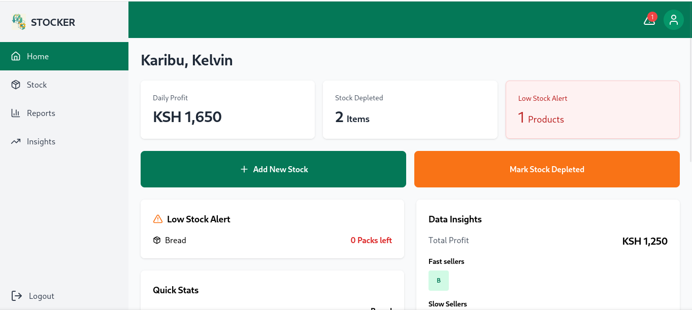
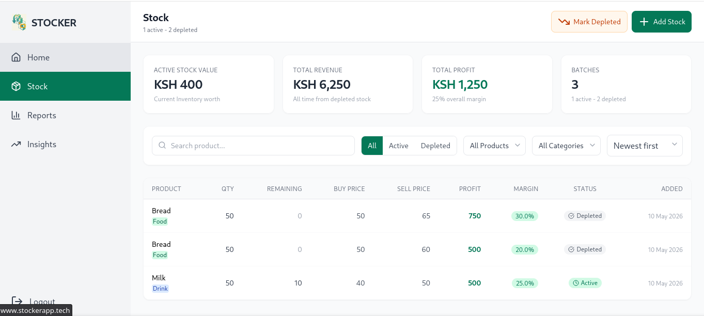
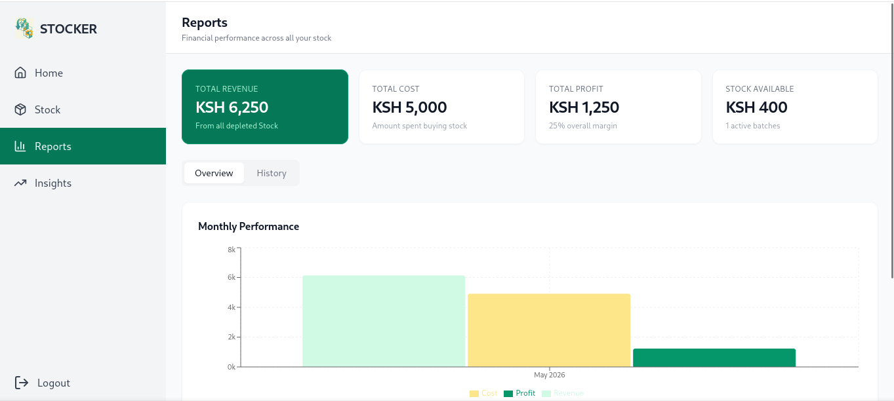
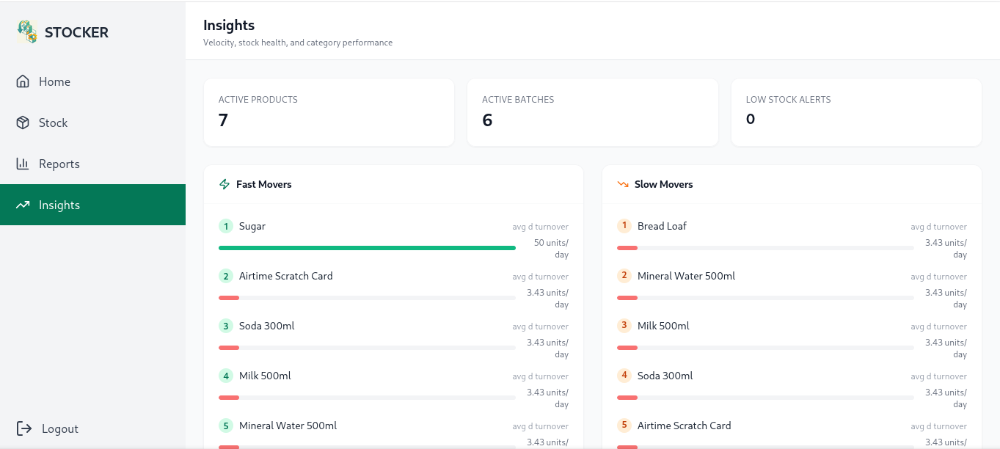

# Stocker - Depletion-Based Inventory Tracker

> **Live at [stockerapp.tech](https://stockerapp.tech)**

A modern inventory and profit tracking tool designed for informal retailers like kiosks and small shops, with a roadmap to support workshops, artisans, and other informal businesses. Track stock by depletion instead of individual sales, reducing cognitive load while providing actionable business insights.







## Features
* Depletion-Based Tracking: Log stock in bulk and mark when depleted
* Automatic Profit Calculation: System estimates revenue and profit
* Stock Velocity Analysis: Identify fast and slow-moving products
* Low Stock Alerts: Never run out of popular items
* Visual Reports: Weekly profit trends and turnover rates
* Simple Data Entry: Minimal input for maximum insights

## Tech Stack
### Backend

* Django 6.0 + Django REST Framework
* PostgreSQL
* JWT Authentication

### Frontend

* React 19 + Vite
* Tailwind CSS
* Recharts
* Axios + React Router

### Try It Out
* Visit [Stocker](https://stockerapp.tech) and click Try Demo on the login page to explore with pre-loaded data — no account needed.

## Local development
### Prerequisites

* Python 3.10+
* Node.js 18+
* PostgreSQL 14+

### Backend Setup
```bash

# Navigate to backend directory
cd backend

# Create virtual environment
python -m venv stock

# Activate
source stock/bin/activate 

# Install dependencies
pip install -r requirements.txt

# Create PostgreSQL database
createdb stocker_db

# Copy environment variables
cp .env.example .env


# Run migrations
python manage.py migrate

# Create superuser
python manage.py createsuperuser

# Run development server
python manage.py runserver
```
### Frontend Setup
```bash
# Navigate to frontend directory
cd frontend

# Install dependencies
npm install

# Copy environment variables
cp .env.example .env

# Run development server
npm run dev 
```

### The application will be available at:

    Frontend: http://localhost:3000
    Backend API: http://localhost:8000
    Admin Panel: http://localhost:8000/admin

## Testing

### Backend Tests
```bash
# Activate virtual environment
source backend/stock/bin/activate

# Run tests for the inventory
python manage.py test inventory

# Run with verbosity
python manage.py test --verbosity=2
```


## API Reference
### Authentication

    POST /api/token/ - Obtain JWT token
    POST /api/token/refresh/ - Refresh JWT token
    POST /api/register/ - Create new account

### Products

    GET /api/products/ - List all products
    POST /api/products/ - Create new product
    GET /api/products/{id}/ - Get product details
    PUT /api/products/{id}/ - Update product
    DELETE /api/products/{id}/ - Delete product

### Stock Batches

    GET /api/batches/ - List all batches
    POST /api/batches/ - Add new stock batch
    GET /api/batches/active/ - Get non-depleted batches
    POST /api/batches/{id}/mark_depleted/ - Mark batch as depleted

### Reports and Insights
    GET /api/dashboard/ - Dashboard statistics
    GET /api/reports/ - Summary financials
    GET /api/reports/by_product/ - Profit breakdown by product
    GET /api/reports/monthly/ - Monthly performance (12 months)
    GET /api/reports/history/ - Paginated depletion history
    GET /api/insights/ - Velocity, stale stock, alerts
    GET /api/insights/velocity/ - Days-until-empty per product
    GET /api/alerts/triggered/ - Active low-stock alerts

## Usage
Stocker uses **depletion-based tracking** instead of point-of-sale:
 
1. **Add Stock** — Log a bulk purchase with quantity, buy price, and sell price
2. **Mark Depleted** — When a batch sells out, mark it finished (or enter partial usage)
3. **Get Insights** — Profit, velocity, and turnover are calculated automatically
This approach matches retailers stock approach, reducing data entry while still producing accurate financial insights.


## Project Structure
```text
stocker/
├── backend/
│   ├── stocker/          # Django project settings & URLs
│   └── inventory/
│       ├── models.py     # Product, StockBatch, PartialDepletion, LowStockAlert
│       ├── serializers.py
│       ├── views.py      # ViewSets for all endpoints
│       ├── urls.py
│       └── tests.py
└── frontend/
    └── src/
        ├── components/   # Sidebar, AddStockModal, DepletionModal, PageLoader
        ├── pages/        # Dashboard, Stock, Reports, Insights, Notfound
        └── services/     # Axios API client with JWT refresh
```

## Roadmap
 
- Offline mode with local storage
- Mobile app (React Native)
- Multi-location / multi-user support
- SMS/push notifications for low stock
- Barcode scanning
- Supplier & credit tracking
- Export reports to PDF/Excel
- Support for service-based and artisan businesses
## Contributing
 
1. Fork the repository
2. Create a feature branch (`git checkout -b feature/my-feature`)
3. Commit your changes
4. Push and open a Pull Request
## License
 
MIT — free to use for commercial projects.
 
